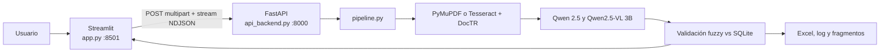
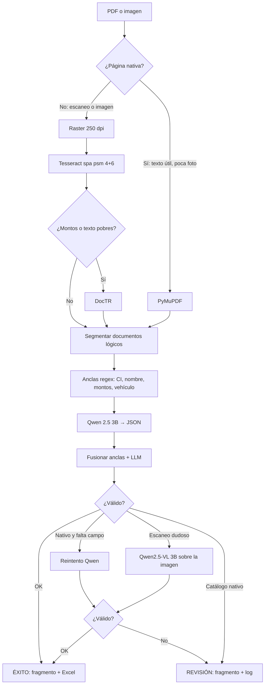
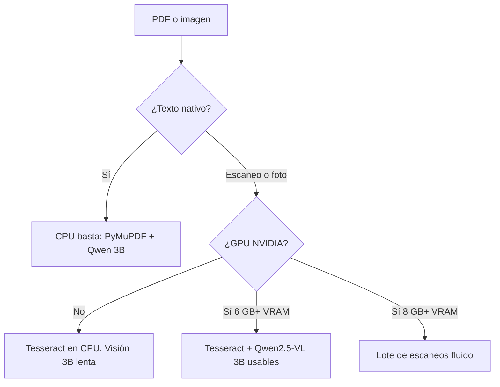

# ManPAC — Extractor de facturas automotrices con IA

Sistema local para leer facturas y proformas de vehículos (PDF o imagen), extraer los datos clave con modelos de IA y validarlos contra un catálogo de vehículos eléctricos. Si la extracción es confiable, el registro entra al Excel de éxitos; si no, el archivo pasa a revisión manual.

Probado en **Windows 10 + Python 3.14**. Los PDF/imágenes de desarrollo son **datos de prueba**, no plantillas: el extractor generaliza por roles (emisor vs comprador), etiquetas y tablas, no por un diseño fijo.

https://github.com/jose-JQ/manpac/
---

## Qué hace

A partir de un documento, el sistema intenta obtener:

| Campo | Significado |
| --- | --- |
| `marca` / `modelo` | Vehículo comercial detectado en el documento |
| `marca_base` / `modelo_base` | Mejor coincidencia en `vehiculos.db` |
| `cantidad` | Unidades |
| `beneficiario` | Nombre o razón social del comprador (persona o empresa) |
| `ci` | Cédula, RUT o RUC del **comprador** (nunca del vendedor) |
| `costo_mas_alto` | Ítem vehicular más caro de la tabla de detalle (puede ser mayor que el total si hay descuento) |
| `costo_total` | Total a pagar |
| `estado` | `ÉXITO` o `REVISIÓN (...motivo...)` |
| `paginas_pdf` | Páginas del PDF que formaron esa factura |
| `archivo_guardado` | Nombre del fragmento PDF copiado a la carpeta de salida |

Un PDF de varias páginas puede contener **varias facturas**. El pipeline las segmenta, guarda cada fragmento lógico y las va devolviendo en tiempo real.

---

## Arquitectura

Hay tres procesos que trabajan juntos:



| Archivo | Rol |
| --- | --- |
| `app.py` | Interfaz: subir lotes, ver extracciones y administrar marcas/modelos |
| `api_backend.py` | API REST. Recibe el archivo, llama al pipeline y **transmite** cada factura (`application/x-ndjson`) |
| `pipeline.py` | Cerebro: OCR, LLMs, validación, Excel y logs |
| `base.py` | Esquema ORM de `vehiculos.db` (marca → modelo → especificación técnica) |
| `vehiculos.db` | Catálogo SQLite con el que se confirma si el vehículo existe |
| `alimentar_base.ipynb` | Notebook opcional para reconstruir/ampliar el catálogo |

La UI **no** carga los modelos de IA. Solo habla con la API. Por eso hay que tener **los dos** servidores encendidos.

---

## Cómo funciona el pipeline

El flujo es el mismo para facturas, proformas, cotizaciones y notas de venta. El sistema no asume un diseño de plantilla: busca **roles** (emisor vs comprador) y **hechos** anclados en el texto.



### 1. Lectura del archivo

Cada página se clasifica con `es_pagina_nativa`:

- **Nativo:** hay texto útil y la hoja no está cubierta por una foto grande. Se usa solo **PyMuPDF**. No se rasteriza ni se llama al modelo de visión.
- **No nativo** (escaneo, foto, PDF imagen): raster 250 dpi con Poppler → **Tesseract** (`spa`, OSD para rotación, `psm 6` + `psm 4`, corrección de texto invertido 180°). Si hay menos de dos montos bien formados, entra **DocTR** (`db_resnet50` + `crnn_vgg16_bn`).

Las imágenes sueltas (PNG/JPG) siempre van por la rama de escaneo.

### 2. Segmentación

`segmentar_documentos_logicos` parte un PDF en **documentos lógicos** (una factura o proforma, no una página suelta). Señales:

- Tipo: factura, proforma, cotización, presupuesto, nota de venta.
- Folio alfanumérico (no solo `PE`/`PRO`/`FAC`).
- Portada con bloque `VENDEDOR` / `COMPRADOR`.
- Continuación: formularios de anexo, líneas de “conforme”, páginas cortas sin encabezado propio.

Cada documento lógico se guarda como fragmento PDF en `procesados_exito/` o `revision_manual/`.

### 3. Extracción (anclas + Qwen)

1. **Hechos regex** (`extraer_hechos_del_texto`): comprador vs vendedor, CI/RUT/RUC, razón social o nombre, marca/modelo, montos coherentes con IVA 0/12/15/19 % y reconstrucción de ítems si el OCR cambia un dígito.
   - Si **no hay** etiquetas `Marca:` / `Modelo:`, usa la ficha técnica (línea sobre batería/autonomía) o la descripción del ítem más caro. Ignora accesorios (`Smart Wallbox`, cargador, kit, placas).
   - Una marca de catálogo suelta (p. ej. la palabra "Smart" en un accesorio) **no** elige un modelo al azar ni marca ÉXITO.
2. **Qwen 2.5 3B** (`qwen2.5:3b`) convierte el texto en JSON, con esos hechos como pista.
3. `aplicar_hechos` veta el RUC/RUT del **vendedor** como CI del comprador, elige el mejor par de montos y, si el texto ya trajo un nombre comercial completo, no lo deja pisar por un accesorio.

El comprador puede ser **persona** (cédula 8–10 dígitos) o **empresa** (RUT chileno o RUC ecuatoriano de 13). Se descartan RUC dummy tipo `0999999999001`.

### 4. Reintento según tipo de página

| Caso | Qué hace |
| --- | --- |
| Nativo y faltan CI, nombre o costos | Segundo pase de **Qwen** (sin visión) |
| Nativo y **no hay marca/modelo en el texto** (solo logo o foto) | Raster + **Qwen2.5-VL 3B** |
| Nativo y el vehículo se leyó pero no está en el catálogo | Queda en **REVISIÓN**. La visión no entra |
| Escaneo y faltan CI, nombre o montos | **Qwen2.5-VL 3B** (`qwen2.5vl:3b`, ~3.2 GB) lee hasta 2 páginas y se fusiona sin pisar un costo bueno |

No hay un tercer modelo “juez”. Llama 3.1 **no** forma parte del flujo.

### 5. Validación

- Costos: formatos `38.500,00` / `38,500.00` / `29.076.817` (CLP). No se “arreglan” concatenados tipo `/10`. Se puntúa el par neto/total contra IVA. Se rechazan totales que parecen km, años o cifras &lt; ~3000 USD salvo millones CLP.
- CI/RUT/RUC del comprador, no del emisor.
- Beneficiario real (no plantillas ni giro/dirección).
- Marca no puede ser un color.
- Coincidencia **fuzzy** contra `vehiculos.db`, ignorando sufijos técnicos (`AC 5P 4X2 TA EV`) y partiendo tokens con guion (`e-Auman` → `AUMAN`).

### 6. Salida

Cada factura se `yield` a la API (la UI la pinta al momento).

- Éxitos → `procesados_exito/` + `reporte_extracciones.xlsx`.
- Fallos → `revision_manual/` + `log_revision_fallos.txt`.

---

## Requisitos mínimos (con o sin GPU)

El sistema **no exige GPU**. Si hay una NVIDIA (o CUDA en PyTorch), **el código la usa solo**: Ollama con `num_gpu` y DocTR en `cuda`. Sin GPU, el mismo flujo sigue en CPU. La GPU no cambia las reglas de validación.



| | **Sin GPU (solo CPU)** | **Con GPU NVIDIA** |
| --- | --- | --- |
| **Mínimo para probar** | CPU 4 núcleos, **16 GB RAM**, 15 GB disco | Lo mismo + **6 GB VRAM** (apretado) |
| **Uso diario** | 8 núcleos, 16–32 GB RAM | **8 GB+ VRAM**, 16 GB RAM |
| **PDF nativo** | Bien | Bien (Qwen en GPU vía Ollama) |
| **Escaneo / foto** | Tesseract sí. Visión 3B lenta en CPU | Qwen2.5-VL 3B en GPU (~3 GB VRAM) |
| **Qué hace el código** | CPU automático | `num_gpu=99` en Ollama; DocTR `.to("cuda")` si `torch.cuda` está |

**Software común a ambos**

- Windows 10/11 (rutas de Poppler/Tesseract pensadas para Windows)
- Python **3.11+**
- Ollama **0.7+** en ejecución + `qwen2.5:3b` (texto) y `qwen2.5vl:3b` (escaneos dudosos)
- Tesseract con idioma `spa` y Poppler (solo páginas no nativas)

**RAM aproximada en marcha**

| Componente | CPU | GPU |
| --- | --- | --- |
| Qwen 2.5 3B (Ollama) | ~2–4 GB RAM | ~2–3 GB VRAM |
| Qwen2.5-VL 3B (Ollama) | ~4 GB RAM, usable | ~3 GB VRAM |
| DocTR (PyTorch) | 1–2 GB RAM extra, lento | CUDA si el `torch` es CUDA |
| Streamlit + FastAPI + SQLite | ~0.5 GB | igual |

En **8 GB de RAM sin GPU** se pueden procesar PDF nativos cortos. AMD/Intel GPU en Windows: Ollama suele ir a CPU.

Si no hay GPU, no hace falta `qwen2.5vl:3b` para el camino nativo. Un escaneo difícil irá a **REVISIÓN** con Tesseract + Qwen texto, o visión en CPU (lento). MiniCPM-V (~8B) se sustituyó porque era demasiado pesado; para volver a él: `set OLLAMA_VISION=minicpm-v`.

`instalar.bat` deja `torch` CPU y, si encuentra `nvidia-smi`, intenta reinstalar PyTorch CUDA (`cu124`) para que DocTR también use la GPU. Ollama **no** usa ese `torch`; tiene su propio runtime y el pipeline le pide GPU cuando hay NVIDIA. Forzar CPU: `set OLLAMA_NUM_GPU=0`.

Si la rueda CUDA no existe para tu Python, DocTR se queda en CPU y Ollama igual puede usar la GPU.

---

## Qué se necesita instalar

### 1. Python (pip)

Ver `requirements.txt`. Las librerías y para qué sirven:

| Librería | Uso |
| --- | --- |
| `streamlit` | Interfaz web local |
| `fastapi` + `uvicorn` + `python-multipart` | API y carga de archivos |
| `requests` | Cliente HTTP de la UI hacia la API |
| `SQLAlchemy` | ORM y consultas a `vehiculos.db` |
| `pandas` + `openpyxl` | Excel de extracciones |
| `pymupdf` | Texto nativo de PDF y recorte de fragmentos |
| `pdf2image` | PDF → imágenes (requiere Poppler) |
| `pytesseract` | OCR clásico (requiere Tesseract `spa`) |
| `python-doctr` + `torch` | OCR neuronal para escaneos difíciles |
| `opencv-python` + `numpy` + `pillow` | Imágenes (DocTR / PIL) |
| `ollama` | Cliente de los modelos locales |

Instalación rápida:

```bat
instalar.bat
```

O a mano:

```bat
python -m venv venv
venv\Scripts\python.exe -m pip install -r requirements.txt
```

La primera vez que DocTR corre, **descarga pesos** (hace falta internet).

### 2. Programas externos (no van por pip)

| Programa | Para qué | Dónde |
| --- | --- | --- |
| **Ollama** | Corre los LLMs en local | https://ollama.com |
| **Tesseract OCR** (idioma `spa`) | OCR de páginas escaneadas | https://github.com/UB-Mannheim/tesseract/wiki   https://drive.google.com/file/d/1Y9quvLPb6aXIrn81h7m_UNvah_Eh48uk/view?usp=sharing  |
| **Poppler** | Convertir PDF a imagen | https://github.com/oschwartz10612/poppler-windows/releases |

Modelos de Ollama que el pipeline espera:

```bat
ollama pull qwen2.5:3b
ollama pull qwen2.5vl:3b
```

- `qwen2.5:3b` — siempre (texto nativo y OCR).
- `qwen2.5vl:3b` — solo escaneos cuando el primer pase no cierra (~3.2 GB; requiere Ollama 0.7+).

Rutas por defecto (se pueden cambiar con variables de entorno):

```bat
set POPPLER_PATH=C:\poppler-26.07.0\Library\bin
set TESSERACT_CMD=C:\Program Files\Tesseract-OCR\tesseract.exe
```

---

## Cómo arrancar

1. Deja **Ollama** en ejecución (`qwen2.5:3b`; `qwen2.5vl:3b` si vas a mandar escaneos).
2. Ejecuta `iniciar.bat` (abre API + UI).
3. Abre http://localhost:8501
4. En **Procesamiento por Lotes**, sube PDF/PNG/JPG y pulsa *Enviar al Servidor IA*.

A mano, en dos terminales:

```bat
venv\Scripts\python.exe api_backend.py
venv\Scripts\streamlit.exe run app.py
```

Comprobación: http://127.0.0.1:8000/api/health

---

## Uso de la interfaz

1. **Procesamiento por Lotes** — sube uno o varios documentos. Cada factura aparece en un expander (verde = éxito, naranja = revisión).
2. **Reporte de Extracciones** — tabla del Excel consolidado y botón de descarga.
3. **Base de Datos de Vehículos** — alta/edición/baja de marcas y modelos. Si un vehículo no está en el catálogo, las facturas reales irán a revisión aunque la IA lea bien el papel.

---

## API

| Método | Ruta | Descripción |
| --- | --- | --- |
| `GET` | `/api/health` | Estado del servidor |
| `POST` | `/api/procesar-factura` | `multipart/form-data` campo `file`. Respuesta NDJSON (una línea JSON por factura) |

---

## Estructura al enviarla

Este paquete **no incluye** facturas de clientes, logs ni el `venv` (pesan y pueden tener datos personales). El receptor instala dependencias con `instalar.bat`.

```
pipeline.py
app.py
api_backend.py
base.py
vehiculos.db
requirements.txt
instalar.bat
iniciar.bat
README.md
alimentar_base.ipynb   (opcional, para regenerar el catálogo)
```

Carpetas que se crean solas al procesar: `temp_api_uploads/`, `procesados_exito/`, `revision_manual/`.

---

## Limitaciones de esta solución

Esto es un extractor **local, híbrido (regex + LLM pequeño + catálogo)**, no un lector fiscal certificado.

1. **El catálogo manda el ÉXITO.** Si la marca/modelo no está en `vehiculos.db` (o el fuzzy no llega al umbral), el documento va a **REVISIÓN aunque el papel se haya leído bien**. No se inventa un match (p. ej. GET ≠ AUDI). Ampliar la BD es la palanca de cobertura, no overfittear una factura de ejemplo.
2. **Los ejemplos no son el producto.** Layouts, idiomas de sello, monedas y identificadores reales varían. El código busca roles y hechos, no un miembro/columna fijos. Un diseño nunca visto puede fallar; se corrige por reglas generales, no copiando el PDF de prueba.
3. **PDF nativo ≫ escaneo ≫ manuscrito.** Sin texto embebido depende de Tesseract y, si hace falta, Qwen2.5-VL 3B. Fotos torcidas o letra a mano bajan precisión. Si Ollama no corre, la visión no existe.
4. **LLM pequeño (Qwen 3B).** Rellena JSON; las anclas regex tienen prioridad. Puede alucinar campos si el texto es pobre. No sustituye un modelo documental grande ni facturación electrónica (XML SRI/SII).
5. **Identidad y montos son heurísticos.** Distingue emisor vs comprador, RUT/RUC/cédula, CLP vs USD e IVA 0/12/15/19 %, pero no valida dígito verificador chileno ni módulo 10 ecuatoriano de forma fiscal. Un total mal OCR-eado puede pasar el umbral de “parece precio”.
6. **Un proceso a la vez.** Lotes en serie. El VLM mira como máximo 2 páginas del documento lógico.
7. **Windows + local.** Poppler/Tesseract con rutas típicas de Windows. No hay cola, auth ni multi-usuario. Primer arranque de DocTR descarga pesos (hace falta red).
8. **ÉXITO / REVISIÓN es binario.** No hay score de confianza por campo ni corrección humana que retroalimente el modelo.

Documentos de prueba (solo ejemplos, no plantillas): https://drive.google.com/file/d/1XIW_EGftxosJTgwKd1E8OlDa-6Of030a/view?usp=sharing

---

## Cómo hacerlo más eficiente y más preciso

Orden práctico, de mayor impacto a menor. Nada de esto debe atarse a un PDF de `docs/`.

### Precisión (calidad del dato)

| Prioridad | Qué | Por qué |
| --- | --- | --- |
| 1 | **Mantener `vehiculos.db` al día** (marcas/modelos reales que van a llegar) | Cierra ÉXITO sin tocar el extractor. Un vehículo nuevo en papel y ausente en BD es REVISIÓN a propósito. |
| 2 | **Preferir PDF nativo o XML** de factura electrónica cuando exista | El texto embebido evita OCR. El XML fiscal (SRI, SII, UBL) daría campos exactos; hoy no se consume. |
| 3 | **Validadores de ID y de suma** | DV de RUT, dígito de cédula/RUC, y comprobar que neto + IVA ≈ total (± descuento). Rechaza lecturas “casi numéricas”. |
| 4 | **Tablas nativas con parser de tabla** (`pdfplumber` / líneas de PyMuPDF), no solo regex de montos | Precio de línea y total salen de celdas, no de un número suelto cerca de “garantía 100.000 km”. |
| 5 | **Visión solo cuando falte identidad o montos** (`qwen2.5vl:3b`) | El 3B de texto no ve el papel. El VL 3B lee facturas y tablas sin el peso de MiniCPM-V 8B. |
| 6 | **JSON acotado** (schema/salida forzada de Ollama) y fusión ancla-primero (ya hay veto de RUC vendedor) | Menos alucinaciones de CI y de marca de accesorio. |
| 7 | **Cola de revisión con corrección** | El humano corrige marca/CI/monto; eso alimenta catálogo o un log de errores. Sin reentrenar, ya sube cobertura. |

No subir el fuzzy “hasta que el ejemplo pase”: GET N230 no debe convertirse en un AUDI. Umbral alto + catálogo completo es más preciso que un match holgado.

### Eficiencia (tiempo y máquina)

| Prioridad | Qué | Por qué |
| --- | --- | --- |
| 1 | **No rasterizar ni llamar visión en PDF nativo** (ya es el diseño) | Ahorra Poppler, Tesseract y el VLM. |
| 2 | **GPU para Ollama** si el lote trae escaneos | El VL 3B en CPU es lento; en nativos Qwen texto en CPU basta. |
| 3 | **DocTR perezoso y condicional** (ya se carga al primer escaneo flojo) | No pagar PyTorch en un lote 100 % nativo. |
| 4 | **Un solo reintento de visión; abortar si Ollama no responde** | Evita esperas dobles cuando el servicio está caído. |
| 5 | **Bajar DPI de raster** (p. ej. 180) si la letra es clara | Menos píxeles = Tesseract y visión más rápidos. |
| 6 | **`keep_alive` de Ollama** y no mezclar VL + Qwen texto si la VRAM es justa | El pipeline descarga el de texto antes de cargar visión. |
| 7 | **Paralelizar documentos, no páginas a ciegas** | Un worker por archivo con lock en Excel. SQLite del catálogo es de lectura y ya va en memoria. |

Regla corta: **catálogo completo + PDF nativo + anclas** da precisión. **GPU + visión** solo recupera escaneos. Los JSON de prueba sirven para regresión, no para enseñarle al sistema un único formato.