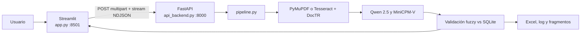
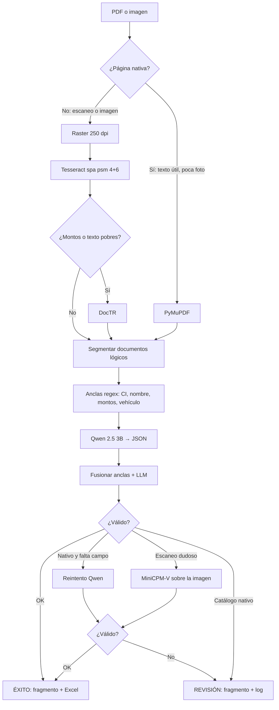

# ManPAC — Extractor de facturas automotrices con IA

Sistema local para leer facturas y proformas de vehículos (PDF o imagen), extraer los datos clave con modelos de IA y validarlos contra un catálogo de vehículos eléctricos. Si la extracción es confiable, el registro entra al Excel de éxitos; si no, el archivo pasa a revisión manual.

Probado en **Windows 10 + Python 3.14**.

---

## Qué hace

A partir de un documento, el sistema intenta obtener:

| Campo | Significado |
| --- | --- |
| `marca` / `modelo` | Vehículo comercial detectado en el documento |
| `marca_base` / `modelo_base` | Mejor coincidencia en `vehiculos.db` |
| `cantidad` | Unidades |
| `beneficiario` | Nombre o razón social del comprador (persona o empresa) |
| `ci` | Cédula, RUT o RUC del **comprador** (nunca del vendedor) |
| `costo_mas_alto` | Ítem vehicular más caro (neto o referencial) |
| `costo_total` | Total a pagar |
| `estado` | `ÉXITO` o `REVISIÓN (...motivo...)` |
| `paginas_pdf` | Páginas del PDF que formaron esa factura |
| `archivo_guardado` | Nombre del fragmento PDF copiado a la carpeta de salida |

Un PDF de varias páginas puede contener **varias facturas**. El pipeline las segmenta, guarda cada fragmento lógico y las va devolviendo en tiempo real.

---

## Arquitectura

Hay tres procesos que trabajan juntos:



| Archivo | Rol |
| --- | --- |
| `app.py` | Interfaz: subir lotes, ver extracciones y administrar marcas/modelos |
| `api_backend.py` | API REST. Recibe el archivo, llama al pipeline y **transmite** cada factura (`application/x-ndjson`) |
| `pipeline.py` | Cerebro: OCR, LLMs, validación, Excel y logs |
| `base.py` | Esquema ORM de `vehiculos.db` (marca → modelo → especificación técnica) |
| `vehiculos.db` | Catálogo SQLite con el que se confirma si el vehículo existe |
| `alimentar_base.ipynb` | Notebook opcional para reconstruir/ampliar el catálogo |

La UI **no** carga los modelos de IA. Solo habla con la API. Por eso hay que tener **los dos** servidores encendidos.

---

## Cómo funciona el pipeline

El flujo es el mismo para facturas, proformas, cotizaciones y notas de venta. El sistema no asume un diseño de plantilla: busca **roles** (emisor vs comprador) y **hechos** anclados en el texto.



### 1. Lectura del archivo

Cada página se clasifica con `es_pagina_nativa`:

- **Nativo:** hay texto útil y la hoja no está cubierta por una foto grande. Se usa solo **PyMuPDF**. No se rasteriza ni se llama a MiniCPM-V.
- **No nativo** (escaneo, foto, PDF imagen): raster 250 dpi con Poppler → **Tesseract** (`spa`, OSD para rotación, `psm 6` + `psm 4`, corrección de texto invertido 180°). Si hay menos de dos montos bien formados, entra **DocTR** (`db_resnet50` + `crnn_vgg16_bn`).

Las imágenes sueltas (PNG/JPG) siempre van por la rama de escaneo.

### 2. Segmentación

`segmentar_documentos_logicos` parte un PDF en **documentos lógicos** (una factura o proforma, no una página suelta). Señales:

- Tipo: factura, proforma, cotización, presupuesto, nota de venta.
- Folio alfanumérico (no solo `PE`/`PRO`/`FAC`).
- Portada con bloque `VENDEDOR` / `COMPRADOR`.
- Continuación: formularios de anexo, líneas de “conforme”, páginas cortas sin encabezado propio.

Cada documento lógico se guarda como fragmento PDF en `procesados_exito/` o `revision_manual/`.

### 3. Extracción (anclas + Qwen)

1. **Hechos regex** (`extraer_hechos_del_texto`): comprador vs vendedor, CI/RUT/RUC, razón social o nombre, marca/modelo (también contra el catálogo), montos coherentes con IVA 0/12/15/19 % y reconstrucción de ítems si el OCR cambia un dígito.
2. **Qwen 2.5 3B** (`qwen2.5:3b`) convierte el texto en JSON, con esos hechos como pista.
3. `aplicar_hechos` veta el RUC/RUT del **vendedor** como CI del comprador, elige el mejor par de montos y confirma marca/modelo si el catálogo ya los vio en el texto.

El comprador puede ser **persona** (cédula 8–10 dígitos) o **empresa** (RUT chileno o RUC ecuatoriano de 13). Se descartan RUC dummy tipo `0999999999001`.

### 4. Reintento según tipo de página

| Caso | Qué hace |
| --- | --- |
| Nativo y faltan CI, nombre o costos | Segundo pase de **Qwen** (sin visión) |
| Nativo y el vehículo no está en el catálogo | Queda en **REVISIÓN**. MiniCPM-V no entra: el texto ya se leyó bien |
| Escaneo y faltan campos, montos incoherentes, total poco creíble o el vehículo no calza | **MiniCPM-V** lee hasta 2 páginas como imagen y se fusiona sin pisar un costo bueno |

No hay un tercer modelo “juez”. Llama 3.1 **no** forma parte del flujo.

### 5. Validación

- Costos: formatos `38.500,00` / `38,500.00` / `29.076.817` (CLP). No se “arreglan” concatenados tipo `/10`. Se puntúa el par neto/total contra IVA. Se rechazan totales que parecen km, años o cifras &lt; ~3000 USD salvo millones CLP.
- CI/RUT/RUC del comprador, no del emisor.
- Beneficiario real (no plantillas ni giro/dirección).
- Marca no puede ser un color.
- Coincidencia **fuzzy** contra `vehiculos.db`, ignorando sufijos técnicos (`AC 5P 4X2 TA EV`) y partiendo tokens con guion (`e-Auman` → `AUMAN`).

### 6. Salida

Cada factura se `yield` a la API (la UI la pinta al momento).

- Éxitos → `procesados_exito/` + `reporte_extracciones.xlsx`.
- Fallos → `revision_manual/` + `log_revision_fallos.txt`.

---

## Qué se necesita instalar

### 1. Python (pip)

Ver `requirements.txt`. Las librerías y para qué sirven:

| Librería | Uso |
| --- | --- |
| `streamlit` | Interfaz web local |
| `fastapi` + `uvicorn` + `python-multipart` | API y carga de archivos |
| `requests` | Cliente HTTP de la UI hacia la API |
| `SQLAlchemy` | ORM y consultas a `vehiculos.db` |
| `pandas` + `openpyxl` | Excel de extracciones |
| `pymupdf` | Texto nativo de PDF y recorte de fragmentos |
| `pdf2image` | PDF → imágenes (requiere Poppler) |
| `pytesseract` | OCR clásico (requiere Tesseract `spa`) |
| `python-doctr` + `torch` | OCR neuronal para escaneos difíciles |
| `opencv-python` + `numpy` + `pillow` | Imágenes (DocTR / PIL) |
| `ollama` | Cliente de los modelos locales |

Instalación rápida:

```bat
instalar.bat
```

O a mano:

```bat
python -m venv venv
venv\Scripts\python.exe -m pip install -r requirements.txt
```

La primera vez que DocTR corre, **descarga pesos** (hace falta internet).

### 2. Programas externos (no van por pip)

| Programa | Para qué | Dónde |
| --- | --- | --- |
| **Ollama** | Corre los LLMs en local | https://ollama.com |
| **Tesseract OCR** (idioma `spa`) | OCR de páginas escaneadas | https://github.com/UB-Mannheim/tesseract/wiki |
| **Poppler** | Convertir PDF a imagen | https://github.com/oschwartz10612/poppler-windows/releases |

Modelos de Ollama que el pipeline espera:

```bat
ollama pull qwen2.5:3b
ollama pull minicpm-v
```

- `qwen2.5:3b` — siempre (texto nativo y OCR).
- `minicpm-v` — solo escaneos cuando el primer pase no cierra.

Rutas por defecto (se pueden cambiar con variables de entorno):

```bat
set POPPLER_PATH=C:\poppler-26.07.0\Library\bin
set TESSERACT_CMD=C:\Program Files\Tesseract-OCR\tesseract.exe
```

---

## Cómo arrancar

1. Deja **Ollama** en ejecución.
2. Ejecuta `iniciar.bat` (abre API + UI).
3. Abre http://localhost:8501
4. En **Procesamiento por Lotes**, sube PDF/PNG/JPG y pulsa *Enviar al Servidor IA*.

A mano, en dos terminales:

```bat
venv\Scripts\python.exe api_backend.py
venv\Scripts\streamlit.exe run app.py
```

Comprobación: http://127.0.0.1:8000/api/health

---

## Uso de la interfaz

1. **Procesamiento por Lotes** — sube uno o varios documentos. Cada factura aparece en un expander (verde = éxito, naranja = revisión).
2. **Reporte de Extracciones** — tabla del Excel consolidado y botón de descarga.
3. **Base de Datos de Vehículos** — alta/edición/baja de marcas y modelos. Si un vehículo no está en el catálogo, las facturas reales irán a revisión aunque la IA lea bien el papel.

---

## API

| Método | Ruta | Descripción |
| --- | --- | --- |
| `GET` | `/api/health` | Estado del servidor |
| `POST` | `/api/procesar-factura` | `multipart/form-data` campo `file`. Respuesta NDJSON (una línea JSON por factura) |

---

## Estructura al enviarla

Este paquete **no incluye** facturas de clientes, logs ni el `venv` (pesan y pueden tener datos personales). El receptor instala dependencias con `instalar.bat`.

```
pipeline.py
app.py
api_backend.py
base.py
vehiculos.db
requirements.txt
instalar.bat
iniciar.bat
README.md
alimentar_base.ipynb   (opcional, para regenerar el catálogo)
```

Carpetas que se crean solas al procesar: `temp_api_uploads/`, `procesados_exito/`, `revision_manual/`.

---

## Limitaciones

- Corre en local; no es un despliegue en la nube.
- MiniCPM-V pide RAM/VRAM. En CPU, los escaneos dudosos serán lentos.
- Vehículos que no existan en `vehiculos.db` (o con OCR muy pobre) salen como `REVISIÓN`.
- Las rutas de Poppler/Tesseract están pensadas para Windows.
- Los PDF de `docs/` son muestras de prueba, no plantillas: el extractor generaliza por roles y anclas, no por un diseño fijo.
