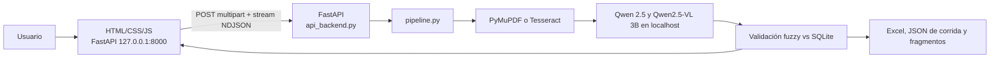
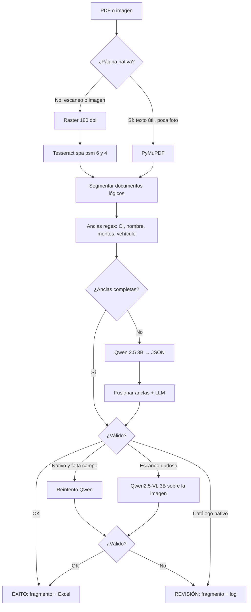
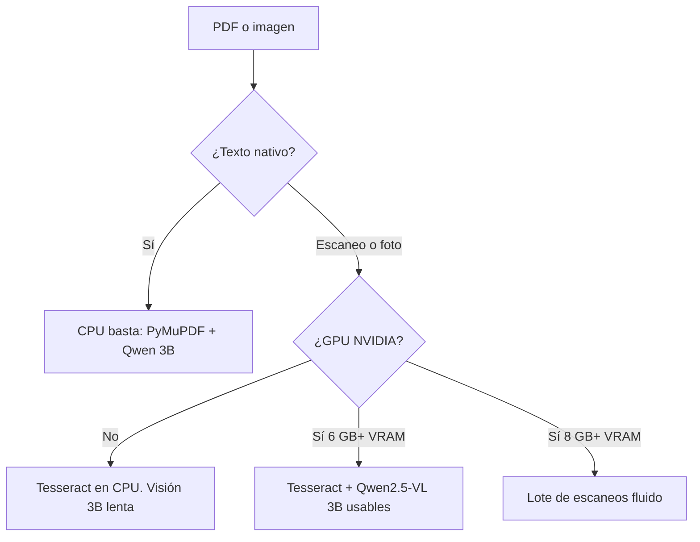

# ManPAC — Extractor de facturas automotrices con IA

Sistema local para leer facturas y proformas de vehículos (PDF o imagen), extraer los datos clave con modelos de IA y validarlos contra un catálogo de vehículos eléctricos. Si la extracción es confiable, el registro entra al Excel de éxitos; si no, el archivo pasa a revisión manual.

Probado en **Windows 10 + Python 3.14**. Los PDF/imágenes de desarrollo son **datos de prueba**, no plantillas: el extractor generaliza por roles (emisor vs comprador), etiquetas y tablas, no por un diseño fijo.

https://github.com/jose-JQ/manpac/
---

## Qué hace

A partir de un documento, el sistema intenta obtener:

| Campo | Significado |
| --- | --- |
| `marca` / `modelo` | Vehículo comercial detectado en el documento |
| `marca_base` / `modelo_base` | Mejor coincidencia en `vehiculos.db` |
| `cantidad` | Unidades |
| `beneficiario` | Nombre o razón social del comprador (persona o empresa) |
| `ci` | Cédula, RUT o RUC del **comprador** (nunca del vendedor) |
| `costo_mas_alto` | Ítem vehicular más caro de la tabla de detalle (puede ser mayor que el total si hay descuento) |
| `costo_total` | Total a pagar |
| `estado` | `ÉXITO` o `REVISIÓN (...motivo...)` |
| `paginas_pdf` | Páginas del PDF que formaron esa factura |
| `archivo_guardado` | Nombre del fragmento PDF copiado a la carpeta de salida |

Un PDF de varias páginas puede contener **varias facturas**. El pipeline las segmenta, guarda cada fragmento lógico y las va devolviendo en tiempo real.

---

## Arquitectura

Hay un solo proceso: FastAPI sirve la UI y la API.


```mermaid
flowchart LR
    usuario[Usuario] --> ui[HTML/CSS/JS<br/>FastAPI 127.0.0.1:8000]
    ui -->|POST multipart + stream NDJSON| api[FastAPI<br/>api_backend.py]
    api --> pipe[pipeline.py]
    pipe --> ocr[PyMuPDF o Tesseract]
    ocr --> llm[Qwen 2.5 y Qwen2.5-VL 3B en localhost]
    llm --> val[Validación fuzzy vs SQLite]
    val --> out[Excel, JSON de corrida y fragmentos]
    val --> ui
```

| Archivo | Rol |
| --- | --- |
| `web/` | Interfaz: HTML, CSS y JS servidos por FastAPI |
| `api_backend.py` | API REST **y** la UI. Recibe el archivo, llama al pipeline y transmite cada factura (`application/x-ndjson`) |
| `pipeline.py` | Cerebro: OCR, LLMs, validación y fragmentos PDF |
| `reportes.py` | Ítems de tabla, Excel reciente/histórico y columna Estado |
| `base.py` | Esquema ORM de `vehiculos.db` (marca → modelo → especificación técnica) |
| `vehiculos.db` | Catálogo SQLite con el que se confirma si el vehículo existe |
| `alimentar_base.ipynb` | Notebook opcional para reconstruir/ampliar el catálogo |

La UI **no** carga los modelos de IA. El navegador habla con el mismo proceso FastAPI en **127.0.0.1:8000**. Ollama queda en **127.0.0.1:11434** (no se expone a la red).

---

## Cómo funciona el pipeline

El flujo es el mismo para facturas, proformas, cotizaciones y notas de venta. El sistema no asume un diseño de plantilla: busca **roles** (emisor vs comprador) y **hechos** anclados en el texto.


```mermaid
flowchart TB
    archivo[PDF o imagen] --> nativo{¿Página nativa?}
    nativo -->|Sí: texto útil, poca foto| pymupdf[PyMuPDF]
    nativo -->|No: escaneo o imagen| raster[Raster 180 dpi]
    raster --> tess[Tesseract spa psm 6 y 4]
    tess --> seg
    pymupdf --> seg[Segmentar documentos lógicos]
    seg --> hechos[Anclas regex: CI, nombre, montos, vehículo]
    hechos --> enough{¿Anclas completas?}
    enough -->|Sí| eval
    enough -->|No| qwen[Qwen 2.5 3B → JSON]
    qwen --> aplicar[Fusionar anclas + LLM]
    aplicar --> eval{¿Válido?}
    eval -->|Nativo y falta campo| qwen2[Reintento Qwen]
    qwen2 --> eval2{¿Válido?}
    eval -->|Escaneo dudoso| mini[Qwen2.5-VL 3B sobre la imagen]
    mini --> eval2
    eval -->|OK| exito
    eval2 -->|OK| exito[ÉXITO: fragmento + Excel]
    eval2 -->|No| rev[REVISIÓN: fragmento + log]
    eval -->|Catálogo nativo| rev
```

### 1. Lectura del archivo

Cada página se clasifica con `es_pagina_nativa`:

- **Nativo:** hay texto útil y la hoja no está cubierta por una foto grande. Se usa solo **PyMuPDF**. No se rasteriza ni se llama al modelo de visión.
- **No nativo** (escaneo, foto, PDF imagen): raster **180 dpi** con Poppler → **Tesseract** (`spa`, `psm 6` y, si el texto es corto, `psm 4`) en paralelo entre páginas.

Las imágenes sueltas (PNG/JPG) siempre van por la rama de escaneo.

### 2. Segmentación

`segmentar_documentos_logicos` parte un PDF en **documentos lógicos** (una factura o proforma, no una página suelta). Señales:

- Tipo: factura, proforma, cotización, presupuesto, nota de venta.
- Folio alfanumérico (no solo `PE`/`PRO`/`FAC`).
- Portada con bloque `VENDEDOR` / `COMPRADOR`.
- Continuación: formularios de anexo, líneas de “conforme”, páginas cortas sin encabezado propio.

Cada documento lógico se guarda como fragmento PDF en `procesados_exito/` o `revision_manual/`.

### 3. Extracción (anclas + Qwen)

1. **Hechos regex** (`extraer_hechos_del_texto`): comprador vs vendedor, CI/RUT/RUC, razón social o nombre, marca/modelo, montos coherentes con IVA 0/12/15/19 % y reconstrucción de ítems si el OCR cambia un dígito.
   - Si **no hay** etiquetas `Marca:` / `Modelo:`, usa la ficha técnica (línea sobre batería/autonomía) o la descripción del ítem más caro. Ignora accesorios (`Smart Wallbox`, cargador, kit, placas).
   - Una marca de catálogo suelta (p. ej. la palabra "Smart" en un accesorio) **no** elige un modelo al azar ni marca ÉXITO.
2. **Qwen 2.5 3B** (`qwen2.5:3b`) convierte el texto en JSON, con esos hechos como pista. Si las anclas ya traen marca, modelo, comprador, CI y un par de montos válido, **se omite** este pase.
3. `aplicar_hechos` veta el RUC/RUT del **vendedor** como CI del comprador, elige el mejor par de montos y, si el texto ya trajo un nombre comercial completo, no lo deja pisar por un accesorio.

El comprador puede ser **persona** (cédula 8–10 dígitos) o **empresa** (RUT chileno o RUC ecuatoriano de 13). Se descartan RUC dummy tipo `0999999999001`.

### 4. Reintento según tipo de página

| Caso | Qué hace |
| --- | --- |
| Nativo y faltan CI, nombre o costos | Segundo pase de **Qwen** (sin visión) |
| Nativo y **no hay marca/modelo en el texto** (solo logo o foto) | Raster + **Qwen2.5-VL 3B** |
| Nativo y el vehículo se leyó pero no está en el catálogo | Queda en **REVISIÓN**. La visión no entra |
| Escaneo y faltan CI, nombre o montos | **Qwen2.5-VL 3B** (`qwen2.5vl:3b`, ~3.2 GB) lee hasta 2 páginas y se fusiona sin pisar un costo bueno |

No hay un tercer modelo “juez”. Llama 3.1 **no** forma parte del flujo.

### 5. Validación

- Costos: formatos `38.500,00` / `38,500.00` / `29.076.817` (CLP). No se “arreglan” concatenados tipo `/10`. Se puntúa el par neto/total contra IVA. Se rechazan totales que parecen km, años o cifras &lt; ~3000 USD salvo millones CLP.
- CI/RUT/RUC del comprador, no del emisor.
- Beneficiario real (no plantillas ni giro/dirección).
- Marca no puede ser un color.
- Coincidencia **fuzzy** contra `vehiculos.db`, ignorando sufijos técnicos (`AC 5P 4X2 TA EV`) y partiendo tokens con guion (`e-Auman` → `AUMAN`).

### 6. Salida

Cada factura se `yield` a la API (la UI la pinta al momento). El visor abre el fragmento desde esas carpetas; no hay una copia extra del original.

- Éxitos → `procesados_exito/` + Excel de la corrida reciente.
- Fallos → `revision_manual/` + `log_revision_fallos.txt`.
- La corrida reciente (`reportes_recientes/corrida.json`) es **todo el último lote**. Un lote nuevo la sustituye; cambiar de pestaña no la borra.

---

## Requisitos mínimos (con o sin GPU)

El sistema **no exige GPU**. Si hay una NVIDIA, **Ollama usa la GPU** (`num_gpu`). Sin GPU, el mismo flujo sigue en CPU. La GPU no cambia las reglas de validación.


```mermaid
flowchart TB
    doc[PDF o imagen] --> tipo{¿Texto nativo?}
    tipo -->|Sí| cpuOk[CPU basta: PyMuPDF + Qwen 3B]
    tipo -->|Escaneo o foto| hw{¿GPU NVIDIA?}
    hw -->|No| cpuScan[Tesseract en CPU. Visión 3B lenta]
    hw -->|Sí 6 GB+ VRAM| gpuScan[Tesseract + Qwen2.5-VL 3B usables]
    hw -->|Sí 8 GB+ VRAM| gpuOk[Lote de escaneos fluido]
```

| | **Sin GPU (solo CPU)** | **Con GPU NVIDIA** |
| --- | --- | --- |
| **Mínimo para probar** | CPU 4 núcleos, **16 GB RAM**, 15 GB disco | Lo mismo + **6 GB VRAM** (apretado) |
| **Uso diario** | 8 núcleos, 16–32 GB RAM | **8 GB+ VRAM**, 16 GB RAM |
| **PDF nativo** | Bien | Bien (Qwen en GPU vía Ollama) |
| **Escaneo / foto** | Tesseract sí. Visión 3B lenta en CPU | Qwen2.5-VL 3B en GPU (~3 GB VRAM) |
| **Qué hace el código** | CPU automático | `num_gpu=99` en Ollama; si hay 8 GB+ VRAM no descarga el modelo de texto antes de visión |

**Software común a ambos**

- Windows 10/11 (rutas de Poppler/Tesseract pensadas para Windows)
- Python **3.11+**
- Ollama **0.7+** en ejecución, **solo en 127.0.0.1:11434** + `qwen2.5:3b` (texto) y `qwen2.5vl:3b` (escaneos dudosos)
- Tesseract con idioma `spa` y Poppler (solo páginas no nativas)

**RAM aproximada en marcha**

| Componente | CPU | GPU |
| --- | --- | --- |
| Qwen 2.5 3B (Ollama) | ~2–4 GB RAM | ~2–3 GB VRAM |
| Qwen2.5-VL 3B (Ollama) | ~4 GB RAM, usable | ~3 GB VRAM |
| FastAPI + SQLite | ~0.5 GB | igual |

### Escenarios de cómputo

| Escenario | CPU | RAM | Disco | GPU | Qué corre y a qué ritmo |
| --- | --- | --- | --- | --- | --- |
| **1. CPU mínimo** | 4 núcleos | 16 GB | 15 GB | No | PDF nativo con Qwen 2.5 3B. Un documento a la vez. Un escaneo con visión puede tardar varios minutos. |
| **2. CPU recomendado** | 8 núcleos | 32 GB | SSD NVMe | No | Lotes de PDF nativos. Tesseract en paralelo. Visión 3B sigue siendo lenta. |
| **3. GPU mínimo** | 4 núcleos | 16 GB | 20 GB | NVIDIA 4–6 GB VRAM | Qwen texto y `qwen2.5vl:3b`. El pipeline descarga texto antes de visión. |
| **4. GPU recomendado** | 8 núcleos | 32 GB | SSD NVMe | 8–16 GB VRAM | Texto y visión en GPU. Escaneos en segundos una vez cargado el VL 3B. |

Oracle (`DB_USER`, `DB_PASS`, `DB_HOST`, `DB_PORT`, `DB_SERVICE`) solo hace falta para **Aceptar reporte**. Sin `.env` el catálogo local SQLite sigue validando modelos. Copia `.env.example` a `.env`.

En **8 GB de RAM sin GPU** se pueden procesar PDF nativos cortos. AMD/Intel GPU en Windows: Ollama suele ir a CPU.

Si no hay GPU, no hace falta `qwen2.5vl:3b` para el camino nativo. Un escaneo difícil irá a **REVISIÓN** con Tesseract + Qwen texto, o visión en CPU (lento). MiniCPM-V (~8B) se sustituyó porque era demasiado pesado; para volver a él: `set OLLAMA_VISION=minicpm-v`.

Ollama **no** comparte proceso con Python: tiene su propio runtime. Forzar CPU: `set OLLAMA_NUM_GPU=0`.

**Puerto de Ollama:** debe ser `http://127.0.0.1:11434`. En la app de Ollama para Windows desactiva *Expose Ollama to the network*. Si el servicio ya escuchaba en `0.0.0.0:11434`, pon `OLLAMA_HOST=127.0.0.1:11434` en las variables de usuario y reinicia Ollama. El cliente de ManPAC rechaza un host que no sea loopback (salvo `MANPAC_ALLOW_REMOTE_OLLAMA=1`). `iniciar.bat` fuerza el cliente a localhost y avisa si `11434` está abierto a la red.

---

## Qué se necesita instalar

### 1. Python (pip)

Ver `requirements.txt`. Las librerías y para qué sirven:

| Librería | Uso |
| --- | --- |
| `fastapi` + `uvicorn` + `python-multipart` | API, UI web y carga de archivos |
| `SQLAlchemy` | ORM y consultas a `vehiculos.db` |
| `pandas` + `openpyxl` | Excel de extracciones |
| `pymupdf` | Texto nativo de PDF y recorte de fragmentos |
| `pdf2image` | PDF → imágenes (requiere Poppler) |
| `pytesseract` | OCR clásico (requiere Tesseract `spa`) |
| `pillow` | Imágenes para OCR y visión |
| `ollama` | Cliente de los modelos locales (solo localhost) |
| `oracledb` + `python-dotenv` | Oracle opcional y `.env` |

Instalación rápida:

```bat
instalar.bat
```

O a mano:

```bat
python -m venv venv
venv\Scripts\python.exe -m pip install -r requirements.txt
```

### 2. Programas externos (no van por pip)

| Programa | Para qué | Dónde |
| --- | --- | --- |
| **Ollama** | Corre los LLMs en local | https://ollama.com |
| **Tesseract OCR** (idioma `spa`) | OCR de páginas escaneadas | https://github.com/UB-Mannheim/tesseract/wiki   https://drive.google.com/file/d/1Y9quvLPb6aXIrn81h7m_UNvah_Eh48uk/view?usp=sharing  |
| **Poppler** | Convertir PDF a imagen | https://github.com/oschwartz10612/poppler-windows/releases |

Modelos de Ollama que el pipeline espera:

```bat
ollama pull qwen2.5:3b
ollama pull qwen2.5vl:3b
```

- `qwen2.5:3b` — siempre (texto nativo y OCR).
- `qwen2.5vl:3b` — solo escaneos cuando el primer pase no cierra (~3.2 GB; requiere Ollama 0.7+).

Rutas por defecto (se pueden cambiar con variables de entorno):

```bat
set POPPLER_PATH=C:\poppler-26.07.0\Library\bin
set TESSERACT_CMD=C:\Program Files\Tesseract-OCR\tesseract.exe
```

---

## Cómo arrancar

1. Deja **Ollama** en ejecución en **127.0.0.1:11434** (`qwen2.5:3b`; `qwen2.5vl:3b` si vas a mandar escaneos). Sin exponer el puerto a la red.
2. Ejecuta `iniciar.bat` (abre un solo servidor FastAPI con la interfaz).
3. Abre http://127.0.0.1:8000
4. En **Procesar**, sube PDF/PNG/JPG y pulsa *Procesar lote*. La tabla de **Corrida reciente** conserva **todos** los documentos de ese lote al cambiar de pestaña.

A mano:

```bat
venv\Scripts\python.exe api_backend.py
```

Comprobación: http://127.0.0.1:8000/api/health

---

## Uso de la interfaz

1. **Procesar** — sube uno o varios documentos. Cada factura entra a una tabla (badge verde = EXITO, ámbar = REVISION).
2. **Reportes** — corrida reciente e histórico, celdas editables, visor del PDF, descarga Excel y *Aceptar en Oracle*.
3. **Vehículos** — alta/edición/baja de marcas y modelos. Si un vehículo no está en el catálogo, las facturas reales irán a revisión aunque la IA lea bien el papel.

No se muestran requisitos de GPU en la interfaz; eso va solo en este README.

---

## API

| Método | Ruta | Descripción |
| --- | --- | --- |
| `GET` | `/` | Interfaz web |
| `GET` | `/api/health` | Estado del servidor y aviso si Ollama está expuesto |
| `POST` | `/api/procesar-factura` | `multipart/form-data` campo `file`. Respuesta NDJSON (una línea JSON por factura) |
| `GET` | `/api/documento` | Visor del fragmento en `procesados_exito/` o `revision_manual/` |
| `POST` | `/api/corrida/iniciar` | Vacía la corrida reciente (solo al empezar un lote) |
| `POST` | `/api/corrida/finalizar` | Descarga los modelos de Ollama al terminar el lote |
| `GET`/`PUT` | `/api/corrida` | Corrida reciente (JSON) |
| `GET` | `/api/corrida/excel` | Excel de éxitos o revisión (`?tipo=exitos\|revision`) |
| `POST` | `/api/corrida/aceptar` | Carga el reporte editado a Oracle |
| `GET` | `/api/historico` | Histórico de ejecuciones |
| `GET`/`POST`/`PUT`/`DELETE` | `/api/catalogo/...` | Marcas y modelos |

---

## Estructura al enviarla

Este paquete **no incluye** facturas de clientes, logs ni el `venv` (pesan y pueden tener datos personales). El receptor instala dependencias con `instalar.bat`.

```
pipeline.py
web/
api_backend.py
reportes.py
oracle_db.py
base.py
vehiculos.db
requirements.txt
instalar.bat
iniciar.bat
README.md
alimentar_base.ipynb   (opcional, para regenerar el catálogo)
```

Carpetas que se crean solas al procesar: `temp_api_uploads/` (temporal), `procesados_exito/`, `revision_manual/`, `reportes_recientes/`.

---

## Limitaciones de esta solución

Esto es un extractor **local, híbrido (regex + LLM pequeño + catálogo)**, no un lector fiscal certificado.

1. **El catálogo manda el ÉXITO.** Si la marca/modelo no está en `vehiculos.db` (o el fuzzy no llega al umbral), el documento va a **REVISIÓN aunque el papel se haya leído bien**. No se inventa un match (p. ej. GET ≠ AUDI). Ampliar la BD es la palanca de cobertura, no overfittear una factura de ejemplo.
2. **Los ejemplos no son el producto.** Layouts, idiomas de sello, monedas y identificadores reales varían. El código busca roles y hechos, no un miembro/columna fijos. Un diseño nunca visto puede fallar; se corrige por reglas generales, no copiando el PDF de prueba.
3. **PDF nativo ≫ escaneo ≫ manuscrito.** Sin texto embebido depende de Tesseract y, si hace falta, Qwen2.5-VL 3B. Fotos torcidas o letra a mano bajan precisión. Si Ollama no corre, la visión no existe.
4. **LLM pequeño (Qwen 3B).** Rellena JSON; las anclas regex tienen prioridad. Puede alucinar campos si el texto es pobre. No sustituye un modelo documental grande ni facturación electrónica (XML SRI/SII).
5. **Identidad y montos son heurísticos.** Distingue emisor vs comprador, RUT/RUC/cédula, CLP vs USD e IVA 0/12/15/19 %, pero no valida dígito verificador chileno ni módulo 10 ecuatoriano de forma fiscal. Un total mal OCR-eado puede pasar el umbral de “parece precio”.
6. **Un proceso a la vez.** Lotes en serie. El VLM mira como máximo 2 páginas del documento lógico.
7. **Windows + local.** Poppler/Tesseract con rutas típicas de Windows. API y Ollama en loopback. No hay cola, auth ni multi-usuario.
8. **ÉXITO / REVISIÓN es binario.** No hay score de confianza por campo ni corrección humana que retroalimente el modelo.

Documentos de prueba (solo ejemplos, no plantillas): https://drive.google.com/file/d/1XIW_EGftxosJTgwKd1E8OlDa-6Of030a/view?usp=sharing

---

## Cómo hacerlo más eficiente y más preciso

Orden práctico, de mayor impacto a menor. Nada de esto debe atarse a un PDF de `docs/`.

### Precisión (calidad del dato)

| Prioridad | Qué | Por qué |
| --- | --- | --- |
| 1 | **Mantener `vehiculos.db` al día** (marcas/modelos reales que van a llegar) | Cierra ÉXITO sin tocar el extractor. Un vehículo nuevo en papel y ausente en BD es REVISIÓN a propósito. |
| 2 | **Preferir PDF nativo o XML** de factura electrónica cuando exista | El texto embebido evita OCR. El XML fiscal (SRI, SII, UBL) daría campos exactos; hoy no se consume. |
| 3 | **Validadores de ID y de suma** | DV de RUT, dígito de cédula/RUC, y comprobar que neto + IVA ≈ total (± descuento). Rechaza lecturas “casi numéricas”. |
| 4 | **Tablas nativas con parser de tabla** (`pdfplumber` / líneas de PyMuPDF), no solo regex de montos | Precio de línea y total salen de celdas, no de un número suelto cerca de “garantía 100.000 km”. |
| 5 | **Visión solo cuando falte identidad o montos** (`qwen2.5vl:3b`) | El 3B de texto no ve el papel. El VL 3B lee facturas y tablas sin el peso de MiniCPM-V 8B. |
| 6 | **JSON acotado** (schema/salida forzada de Ollama) y fusión ancla-primero (ya hay veto de RUC vendedor) | Menos alucinaciones de CI y de marca de accesorio. |
| 7 | **Cola de revisión con corrección** | El humano corrige marca/CI/monto; eso alimenta catálogo o un log de errores. Sin reentrenar, ya sube cobertura. |

No subir el fuzzy “hasta que el ejemplo pase”: GET N230 no debe convertirse en un AUDI. Umbral alto + catálogo completo es más preciso que un match holgado.

### Eficiencia (tiempo y máquina)

| Prioridad | Qué | Por qué |
| --- | --- | --- |
| 1 | **No rasterizar ni llamar visión en PDF nativo** (ya es el diseño) | Ahorra Poppler, Tesseract y el VLM. |
| 2 | **GPU para Ollama** si el lote trae escaneos | El VL 3B en CPU es lento; en nativos Qwen texto en CPU basta. |
| 3 | **No instalar PyTorch/DocTR** | El OCR vivo es Tesseract; no paga VRAM extra. |
| 4 | **Un solo reintento de visión; abortar si Ollama no responde** | Evita esperas dobles cuando el servicio está caído. |
| 5 | **Raster 180 dpi** | Menos píxeles = Tesseract y visión más rápidos. |
| 6 | **`keep_alive` de Ollama**; no descargar texto antes de VL si hay 8 GB+ VRAM; al terminar el lote `keep_alive=0` | Menos thrashing. |
| 7 | **Tesseract en paralelo entre páginas** de un mismo PDF | Un chat Ollama a la vez (la GPU no se pelea). |

Regla corta: **catálogo completo + PDF nativo + anclas** da precisión. **GPU + visión** solo recupera escaneos. Los JSON de prueba sirven para regresión, no para enseñarle al sistema un único formato.